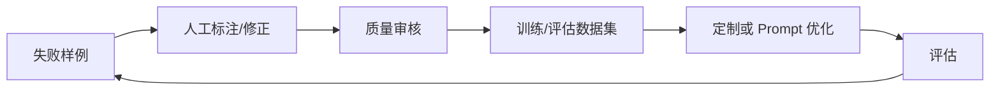

# 训练数据、验证集与质量控制

模型定制的质量上限通常由数据决定。坏数据不会因为训练变好，只会变成更稳定的坏行为。

## 样例结构

最小样例可以包含：

```json
{
  "input": "把这句话改成客服口吻：退款好了",
  "output": "您的退款已处理完成，请关注到账通知。",
  "tags": ["客服口吻", "退款"],
  "source": "人工标注",
  "reviewed": true
}
```

真实项目建议额外记录：

1. 来源。
2. 标注人。
3. 审核人。
4. 业务版本。
5. 适用范围。
6. 是否包含敏感信息。

## 数据质量检查

| 检查 | 目的 |
| --- | --- |
| 字段完整性 | 避免缺 input/output |
| 重复样例 | 避免数据偏置 |
| 标签分布 | 避免只覆盖少数场景 |
| 敏感信息 | 避免训练进隐私 |
| 错误示例 | 避免教坏模型 |
| 版本一致性 | 避免新旧规则混杂 |

## 训练集、验证集、评估集

不要把所有数据都拿去训练。至少拆成：

1. 训练集：用于模型学习。
2. 验证集：用于训练中观察。
3. 评估集：用于上线前独立判断。

评估集不要被训练过程污染。否则你只是在考试前把答案发给学生。

## 数据迭代闭环



每次新增数据，都要问：

1. 它解决了哪个失败模式？
2. 是否有同类样例过多？
3. 是否会引入错误行为？
4. 是否需要更新评估集？

## 版本管理

建议版本号：

```text
customer-tone-dataset:v2026.07.09
customer-tone-eval:v2026.07.09
customer-tone-model:v3
```

上线时记录模型版本与数据版本的对应关系，方便回滚和复盘。
