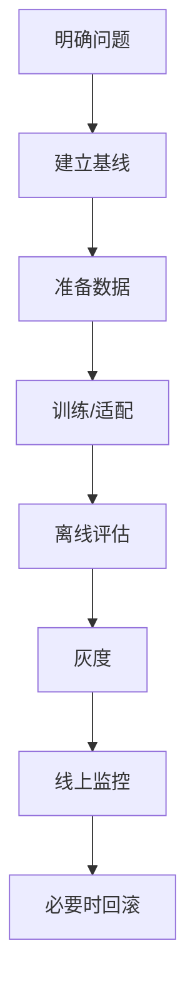

# 模型定制上线流程

模型定制不是训练完成就上线。它需要像后端服务一样经历评估、灰度、监控和回滚。

## 流程



## 建立基线

定制前先记录：

1. 当前 Prompt/RAG 方案通过率。
2. 当前成本和延迟。
3. 典型失败样例。
4. 当前用户反馈。

没有基线，就无法证明定制值得。

## 灰度策略

可以按用户、租户、场景或任务类型灰度：

| 灰度维度 | 示例 |
| --- | --- |
| 用户 | 内部员工先用 |
| 租户 | 低风险客户先开 |
| 场景 | 只用于客服改写 |
| 任务 | 只用于分类，不用于生成 |

灰度期间要比较新旧版本：

1. 质量是否提高。
2. 延迟是否变差。
3. 成本是否下降。
4. 是否出现新类型错误。

## 回滚

模型定制必须可回滚。后端网关不要把模型 ID 写死在业务代码里，而应该通过配置或模型别名路由。

```json
{
  "route": "customer_tone_rewrite",
  "model_alias": "customer-tone-prod",
  "fallback_model": "general-text-model"
}
```

当新模型出问题时，切回别名或 fallback，而不是紧急发版。

## 供应商变化

不同供应商对微调、适配器、私有部署和数据留存的支持差异很大，而且会变化。上线前要确认：

1. 当前账号是否有训练权限。
2. 支持哪些基座模型。
3. 训练数据如何保存和删除。
4. 定制模型生命周期。
5. 价格、推理延迟和并发限制。

不要把课程示例当成当前平台承诺，生产项目必须查最新文档。
