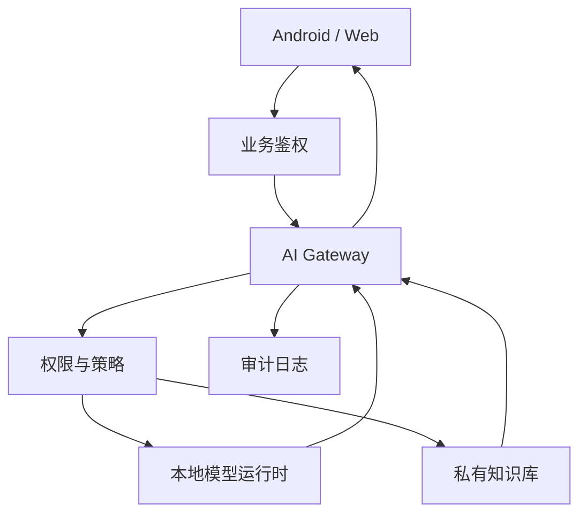

# 私有化网关、权限与观测

即使模型跑在自己服务器上，也不建议让 Android 或前端直接连模型运行时。中间仍然需要业务 AI Gateway。

## 为什么需要网关

模型运行时通常只关心推理，不关心业务权限。网关负责：

1. 用户鉴权。
2. 租户隔离。
3. 模型路由。
4. Prompt 版本。
5. RAG 权限过滤。
6. 工具调用授权。
7. 成本、延迟和错误监控。
8. 降级和回退。

没有网关时，Android、Web、后台脚本可能会各自直连模型运行时，最后出现这些问题：

1. 权限策略分散，难以审计。
2. Prompt 版本不统一，结果不可回归。
3. 失败和超时处理不一致。
4. 模型切换需要改多个客户端。
5. 成本、延迟和错误无法统一统计。

## 私有化架构



## 权限策略

私有化环境经常服务多个部门或租户。RAG 检索时必须先按权限过滤，再把内容交给模型。

错误做法：

```text
先检索所有文档 -> 交给模型 -> 让模型自己判断能不能看
```

正确做法：

```text
先根据用户权限过滤文档集合 -> 在可见集合内检索 -> 再交给模型
```

模型不是权限系统。

## 网关策略配置

私有化网关应该把策略显式配置出来，而不是写死在代码里：

```json
{
  "tenant": "android_team",
  "allowedModels": ["local_qwen_small", "cloud_reasoning_backup"],
  "defaultModel": "local_qwen_small",
  "fallbackModel": "cloud_reasoning_backup",
  "maxInputTokens": 12000,
  "maxOutputTokens": 1200,
  "ragVisibility": ["android_team", "public"],
  "allowExternalNetwork": false,
  "highRiskToolsRequireConfirmation": true
}
```

这些配置要能被日志记录。否则线上问题发生后，很难判断当时到底用了哪个模型、哪个 Prompt、哪个权限集合。

## 降级与回退

本地模型不可用时，不一定总是切云端。要按场景设计：

| 故障 | 降级 |
| --- | --- |
| 本地模型超时 | 切小模型、缩短上下文或提示稍后重试 |
| GPU 队列过长 | 限流低优先级请求 |
| RAG 索引不可用 | 返回“知识库暂不可用”，不要编答案 |
| 私有网络断开 | 进入离线草稿模式 |
| 云端兜底不可用 | 返回可理解错误并记录告警 |

如果因为隐私规则不能走云端，就不要自动切云端。降级策略也要受权限和合规约束。

## 可观测性

本地模型也要记录：

1. 请求数。
2. token 数。
3. 首 token 延迟。
4. 总耗时。
5. GPU/CPU/内存使用率。
6. 队列长度。
7. 错误率。
8. 生成中断和超时。

如果本地模型不可用，网关要能切到云端模型或返回可理解的降级结果。

## 审计日志字段

建议记录：

| 字段 | 说明 |
| --- | --- |
| `requestId` | 串联客户端、网关、模型、工具和日志 |
| `tenantId` / `userId` | 权限和成本归因 |
| `model` / `modelVersion` | 模型版本 |
| `promptVersion` | Prompt 版本 |
| `retrieverVersion` | 检索策略和知识库版本 |
| `routeReason` | 为什么选择本地或云端 |
| `inputTokens` / `outputTokens` | 成本和容量 |
| `firstTokenLatencyMs` | 首 token 延迟 |
| `totalLatencyMs` | 总耗时 |
| `fallbackUsed` | 是否触发降级 |
| `policyDecision` | 权限或安全策略结果 |

日志要脱敏。不要把完整用户隐私、密钥、内部代码或不可公开文档原文直接写进普通日志。

## 私有化上线检查

- [ ] 模型许可证允许当前用途。
- [ ] Android/Web 不直连模型运行时。
- [ ] 网关能按租户和用户过滤知识库。
- [ ] 模型、Prompt、知识库版本进入日志。
- [ ] GPU/CPU/内存/队列长度有监控。
- [ ] 本地模型超时和不可用有降级策略。
- [ ] 安全红队用例覆盖 Prompt 注入、越权工具和日志泄露。
- [ ] 有回滚到旧模型或云端兜底的路径。

## 本章小结

私有化网关的价值不是多包一层 HTTP，而是把模型能力纳入业务权限、策略、观测和回退体系。模型运行时负责推理，网关负责可控使用。
