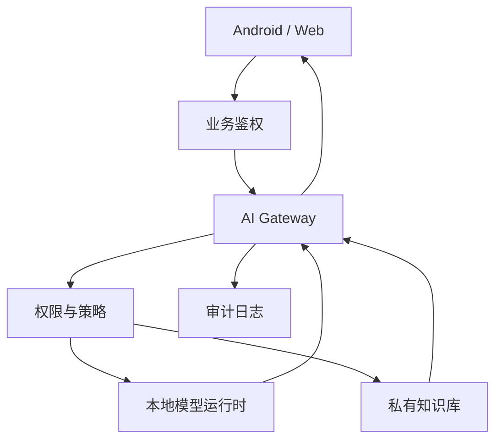

# 私有化网关、权限与观测

即使模型跑在自己服务器上，也不建议让 Android 或前端直接连模型运行时。中间仍然需要业务 AI Gateway。

## 为什么需要网关

模型运行时通常只关心推理，不关心业务权限。网关负责：

1. 用户鉴权。
2. 租户隔离。
3. 模型路由。
4. Prompt 版本。
5. RAG 权限过滤。
6. 工具调用授权。
7. 成本、延迟和错误监控。
8. 降级和回退。

## 私有化架构



## 权限策略

私有化环境经常服务多个部门或租户。RAG 检索时必须先按权限过滤，再把内容交给模型。

错误做法：

```text
先检索所有文档 -> 交给模型 -> 让模型自己判断能不能看
```

正确做法：

```text
先根据用户权限过滤文档集合 -> 在可见集合内检索 -> 再交给模型
```

模型不是权限系统。

## 可观测性

本地模型也要记录：

1. 请求数。
2. token 数。
3. 首 token 延迟。
4. 总耗时。
5. GPU/CPU/内存使用率。
6. 队列长度。
7. 错误率。
8. 生成中断和超时。

如果本地模型不可用，网关要能切到云端模型或返回可理解的降级结果。
