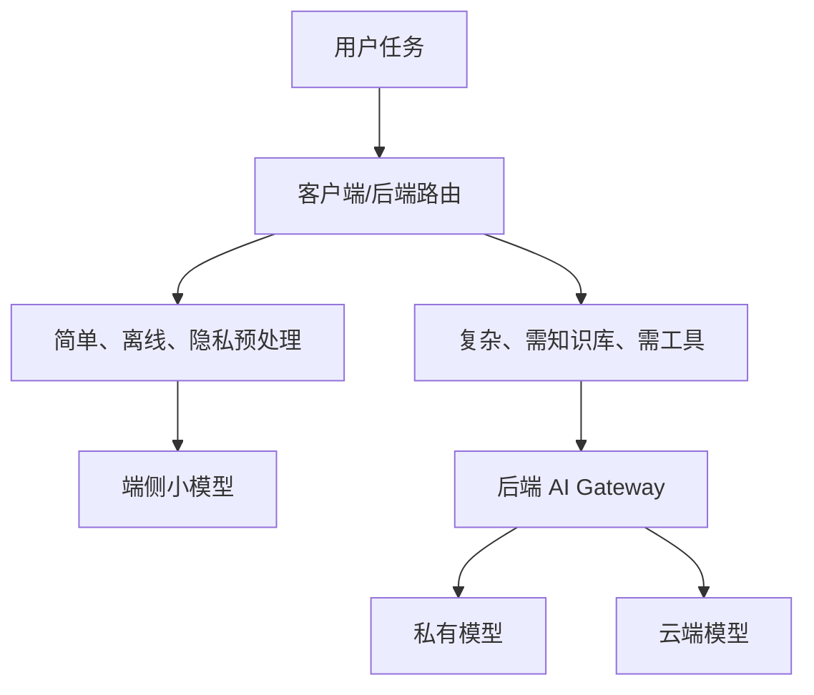

# Android 接入与云边协同

Android 端接入本地或私有化模型时，仍然应该面对自己的业务后端，而不是直接面对模型运行时。

## 接入形态

| 形态 | 说明 |
| --- | --- |
| App -> 私有后端 -> 本地模型 | 企业内网或专有云场景 |
| App -> 后端路由 -> 云端/本地混合 | 根据隐私、成本、容量动态路由 |
| App 本机小模型 | 离线、低延迟、轻量任务 |
| App 本机 + 云端兜底 | 本机处理简单任务，云端处理复杂任务 |

## Android 本机模型的限制

本机模型适合：

1. 简单分类。
2. 离线草稿。
3. 轻量改写。
4. 隐私敏感的预处理。

不适合一开始就承担：

1. 长文档 RAG。
2. 高质量复杂推理。
3. 多工具 Agent。
4. 大规模并发。

移动端还有电量、发热、包体、内存和设备差异问题。

## 云边协同路由

## 客户端策略

Android 端应该关心：

1. 当前网络状态。
2. 是否允许离线处理。
3. 是否包含敏感信息。
4. 本机模型是否可用。
5. 后端是否返回降级策略。
6. 用户是否知道当前模式。

例如 UI 可以显示“离线草稿模式”或“已切换到云端增强模式”，让用户对能力差异有预期。
