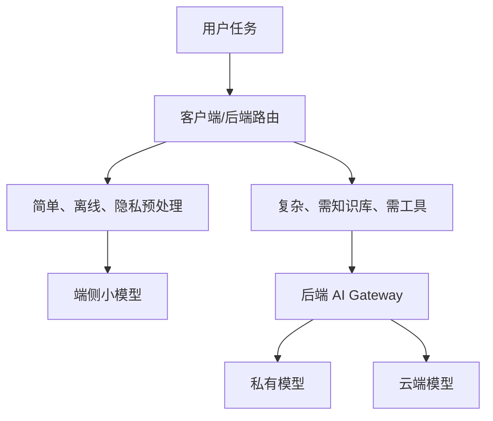

# Android 接入与云边协同

Android 端接入本地或私有化模型时，仍然应该面对自己的业务后端，而不是直接面对模型运行时。

## 接入形态

| 形态 | 说明 |
| --- | --- |
| App -> 私有后端 -> 本地模型 | 企业内网或专有云场景 |
| App -> 后端路由 -> 云端/本地混合 | 根据隐私、成本、容量动态路由 |
| App 本机小模型 | 离线、低延迟、轻量任务 |
| App 本机 + 云端兜底 | 本机处理简单任务，云端处理复杂任务 |

推荐默认架构仍然是：

```text
Android App -> 业务后端 -> AI Gateway -> 本地模型 / 云端模型 / 端侧策略
```

Android 端可以参与“是否离线、是否包含敏感信息、是否允许上传”的判断，但最终模型路由、权限过滤和工具执行仍应由后端控制。

## Android 本机模型的限制

本机模型适合：

1. 简单分类。
2. 离线草稿。
3. 轻量改写。
4. 隐私敏感的预处理。

不适合一开始就承担：

1. 长文档 RAG。
2. 高质量复杂推理。
3. 多工具 Agent。
4. 大规模并发。

移动端还有电量、发热、包体、内存和设备差异问题。

## 端侧适合做什么

| 任务 | 是否适合端侧 | 原因 |
| --- | --- | --- |
| 输入脱敏预处理 | 适合 | 可先移除手机号、token、截图敏感区域 |
| 简单分类 | 适合 | 低延迟、离线可用 |
| 草稿改写 | 适合 | 质量要求相对可控 |
| 长文档 RAG | 不适合第一版 | 文档索引、权限和上下文都更适合后端 |
| 多工具 Agent | 不适合第一版 | 权限、日志、失败恢复复杂 |
| 高质量复杂推理 | 通常不适合端侧 | 端侧模型能力和资源受限 |

端侧模型更像“本地助手”和“隐私预处理器”，不要一开始让它承担核心推理。

## 云边协同路由



路由可以先按规则做，不要一开始就复杂化：

```text
如果离线且任务简单 -> 端侧小模型
如果包含敏感信息且不能出域 -> 私有模型
如果需要 RAG/工具/高质量推理 -> 后端网关
如果本地模型失败且允许云端 -> 云端兜底
否则 -> 明确告诉用户当前不可处理
```

## 客户端策略

Android 端应该关心：

1. 当前网络状态。
2. 是否允许离线处理。
3. 是否包含敏感信息。
4. 本机模型是否可用。
5. 后端是否返回降级策略。
6. 用户是否知道当前模式。

例如 UI 可以显示“离线草稿模式”或“已切换到云端增强模式”，让用户对能力差异有预期。

## UI 状态建议

Android 端要把不同路由模式展示清楚：

| 状态 | UI 提示 |
| --- | --- |
| `LocalDraft` | “离线草稿模式，答案可能较粗略” |
| `PrivateModel` | “正在使用企业内网模型” |
| `CloudEnhanced` | “正在使用云端增强能力” |
| `Fallback` | “当前模型繁忙，已切换备用方案” |
| `Unavailable` | “当前网络或权限不满足，无法处理该请求” |

这样用户能理解为什么同一个问题在不同网络或权限下表现不同。

## Android 请求字段

客户端可以把路由相关信息传给后端，但不要让客户端单方面决定模型：

```json
{
  "message": "帮我总结这段崩溃日志",
  "clientContext": {
    "networkType": "wifi",
    "isOffline": false,
    "allowsCloudProcessing": false,
    "containsSensitiveData": true,
    "onDeviceModelAvailable": true
  }
}
```

后端根据用户权限、租户策略、任务类型和资源状态做最终路由。

## 本章小结

云边协同不是把模型随便塞进 App，而是把端侧、私有模型和云端模型放进同一个策略体系。Android 端负责体验和本地状态，后端负责权限、路由、审计和降级。
