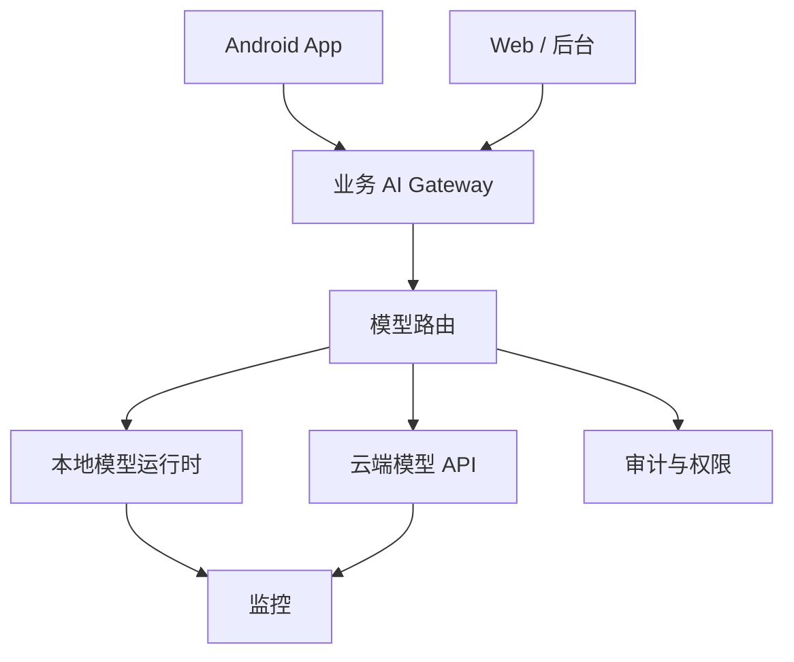

# 阶段十七：本地模型与私有化部署

本阶段目标是理解什么时候需要本地模型或私有化部署，以及它会带来哪些工程代价。私有化不是“免费使用模型”，而是把云端 API 的一部分复杂度换成机器、显存、运维、模型授权、性能优化和安全治理。

## 本阶段你会学到什么

1. 本地模型、私有化部署、云端 API 的取舍。
2. 模型运行时、网关、鉴权、监控和回退架构。
3. 如何粗略估算模型显存/内存需求。
4. 如何把 Android 和后端接入本地模型网关。
5. 如何处理隐私、许可证、吞吐和延迟。
6. 如何运行一个离线本地模型网关决策 Demo。
7. 如何在 Java/Android 中加载分类模型并验证跨端一致性。
8. 如何用 Ollama 和 llama.cpp 运行同一个生成模型，通过本地 API 调用，并记录安全边界与可复现基准。

## 章节目录

1. [本地模型与运行时基础](./01-本地模型与运行时基础.md)
2. [私有化网关、权限与观测](./02-私有化网关权限与观测.md)
3. [Android 接入与云边协同](./03-Android接入与云边协同.md)
4. [Demo：本地模型网关决策](./04-Demo-本地模型网关决策.md)
5. [Ollama 与 llama.cpp 本地部署实战](./05-Ollama与llama.cpp本地部署实战.md)
6. [意图分类模型部署到 Android](./06-意图分类模型部署到Android.md)

## 架构图

## 什么时候值得私有化

不要因为“听起来更安全”就私有化。可以先用下面矩阵判断：

| 条件 | 更适合云端 API | 更适合本地/私有化 |
| --- | --- | --- |
| 数据敏感度 | 普通业务数据，能脱敏 | 强监管、内网隔离、不能出域 |
| 流量规模 | 低到中等，波动大 | 高且稳定，能摊薄机器成本 |
| 能力要求 | 需要最新强模型、多模态、工具生态 | 固定任务、可接受本地模型能力 |
| 运维能力 | 团队没有 GPU/推理服务经验 | 有基础设施和模型运维能力 |
| 延迟目标 | 可接受公网 API 延迟 | 内网低延迟或离线要求 |
| 成本结构 | 按量付费更灵活 | 自建机器长期更可控 |

如果只有“想省钱”这一个理由，通常先做成本监控、缓存、模型路由和 Prompt 压缩，而不是直接私有化。

## 本阶段练习

用“Android 团队内部知识库助手”做一次私有化评估：

1. 列出哪些输入不能离开公司网络。
2. 估算每天请求数、平均输入/输出 token、并发峰值。
3. 判断哪些任务适合本地模型，哪些仍应走云端强模型。
4. 设计本地模型不可用时的降级策略。
5. 写出至少 5 个必须记录的监控指标。

## 和贯穿项目的关系

在综合项目里，本阶段回答这些问题：

1. Android 知识库助手是否必须私有化。
2. 哪些问题能用本地模型，哪些必须走云端强模型。
3. 私有模型不可用时怎么降级。
4. 企业内网部署时，AI Gateway 应该记录哪些审计字段。
5. Android UI 是否需要提示“离线草稿模式”或“企业内网模型”。

## 学完后的自检问题

- 我能不能说明私有化部署的真实成本来自哪里？
- 我能不能粗略估算模型权重、KV cache、并发和上下文对显存的影响？
- 我能不能解释为什么本地模型仍然需要网关、权限和审计？
- 我能不能设计本地模型失败时的降级策略？
- 我能不能说出 Android 端适合做哪些端侧 AI 任务？

## 官方资料

- [Ollama API introduction](https://docs.ollama.com/api/introduction)
- [Hugging Face Text Generation Inference](https://huggingface.co/docs/text-generation-inference/en/index)
- [Hugging Face Transformers](https://huggingface.co/docs/transformers/en/index)
- [OpenAI production best practices](https://developers.openai.com/api/docs/guides/production-best-practices)
