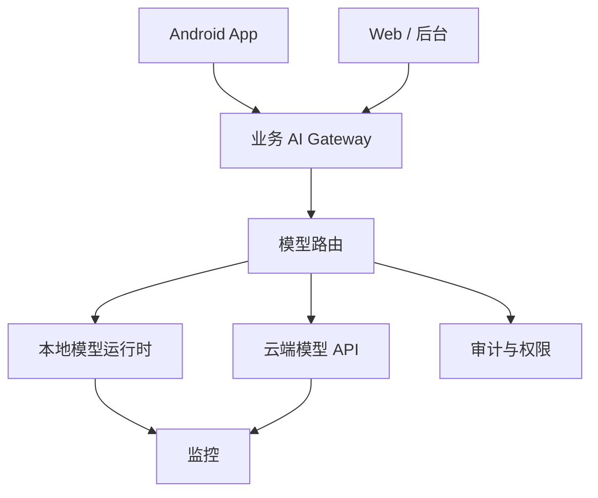

# 阶段十七：本地模型与私有化部署

本阶段目标是理解什么时候需要本地模型或私有化部署，以及它会带来哪些工程代价。私有化不是“免费使用模型”，而是把云端 API 的一部分复杂度换成机器、显存、运维、模型授权、性能优化和安全治理。

## 本阶段你会学到什么

1. 本地模型、私有化部署、云端 API 的取舍。
2. 模型运行时、网关、鉴权、监控和回退架构。
3. 如何粗略估算模型显存/内存需求。
4. 如何把 Android 和后端接入本地模型网关。
5. 如何处理隐私、许可证、吞吐和延迟。
6. 如何运行一个离线本地模型网关决策 Demo。

## 章节目录

1. [本地模型与运行时基础](./01-本地模型与运行时基础.md)
2. [私有化网关、权限与观测](./02-私有化网关权限与观测.md)
3. [Android 接入与云边协同](./03-Android接入与云边协同.md)
4. [Demo：本地模型网关决策](./04-Demo-本地模型网关决策.md)

## 架构图

## 官方资料

- [Ollama API introduction](https://docs.ollama.com/api/introduction)
- [Hugging Face Text Generation Inference](https://huggingface.co/docs/text-generation-inference/en/index)
- [Hugging Face Transformers](https://huggingface.co/docs/transformers/en/index)
- [OpenAI production best practices](https://developers.openai.com/api/docs/guides/production-best-practices)
