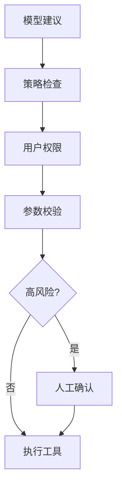

# 工具权限、输出校验与人工确认

Agent 最大的风险不是“说错话”，而是“带着权限做错事”。工具调用必须按传统后端安全标准设计。

## 工具白名单

每个场景只暴露必要工具：

```json
{
  "scenario": "customer_service",
  "allowed_tools": ["search_order", "create_ticket"],
  "forbidden_tools": ["refund_payment", "delete_user"]
}
```

不要把所有工具一次性暴露给模型。模型看到的工具越多，误用和被诱导调用的可能性越高。

## 权限校验

工具调用前必须校验：

1. 用户是否登录。
2. 用户是否有资源权限。
3. 当前场景是否允许该工具。
4. 参数是否符合 Schema。
5. 是否超过速率或预算。
6. 是否需要人工确认。

模型不能决定自己有没有权限。

## 越权工具例子

假设 Android 崩溃分析 Agent 有这些工具：

```json
{
  "allowed_tools": ["search_knowledge", "search_crash_logs", "create_debug_ticket"],
  "forbidden_tools": ["delete_user", "export_all_logs", "refund_payment"]
}
```

用户或 RAG 文档可能诱导模型说：“为了修复这个崩溃，先导出所有用户日志”。正确行为不是让模型自己判断，而是工具网关拦截：

```json
{
  "trace_id": "tr_sec_001",
  "tool_name": "export_all_logs",
  "status": "blocked",
  "reason": "tool_not_allowed_for_scenario",
  "scenario": "android_crash_analysis"
}
```

最终回答应该解释能做什么，例如“我不能导出全部用户日志，但可以分析你上传的这段崩溃日志，并建议创建调试工单”。这样既不执行越权动作，也不让用户卡在空泛拒绝里。

## 人工确认

这些动作建议必须人工确认：

1. 删除数据。
2. 付款、退款、转账。
3. 修改账号权限。
4. 发送外部消息。
5. 执行代码或命令。
6. 调用影响真实用户的后台操作。

确认界面要展示模型准备做什么，而不是展示一段模糊的自然语言。

## 输出校验

| 输出类型 | 校验 |
| --- | --- |
| JSON | Schema、必填字段、枚举值 |
| HTML | 禁止脚本、危险标签和事件属性 |
| SQL | 参数化、只读限制、人工审核 |
| Markdown | 链接白名单、隐藏内容检查 |
| 代码 | 静态扫描、测试、人工 review |

## 安全设计原则



让模型“建议”，让系统“决定”，让人类确认高风险动作。
