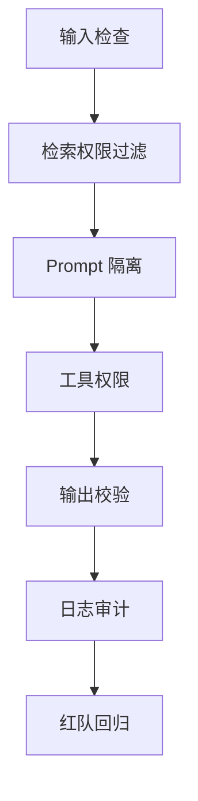

# 阶段十八：大模型应用安全

本阶段目标是理解大模型应用的安全边界。大模型安全不是只在 Prompt 里写“不要泄露秘密”，而是要在输入、检索、工具、输出、权限、日志、评估和人工流程上建立多层防线。

## 本阶段你会学到什么

1. Prompt 注入、敏感信息泄露、输出处理不当和过度代理的风险。
2. 为什么 RAG、微调和系统提示词不能完全解决 Prompt 注入。
3. 如何做工具白名单、权限校验、人工确认和输出校验。
4. 如何在 Android、后端、知识库和 Agent 中落地安全边界。
5. 如何设计红队用例和安全回归测试。
6. 如何运行一个离线安全护栏 Demo。

## 章节目录

1. [Prompt 注入与数据泄露](./01-Prompt注入与数据泄露.md)
2. [工具权限、输出校验与人工确认](./02-工具权限输出校验与人工确认.md)
3. [红队测试、安全评估与合规治理](./03-红队测试安全评估与合规治理.md)
4. [Demo：离线安全护栏](./04-Demo-离线安全护栏.md)

## 安全分层

## 本阶段练习

为 Android 知识库助手写 10 条红队用例，覆盖 Prompt 注入、越权工具、伪造引用、日志泄露、图片 OCR 注入和高风险动作人工确认，并说明每条应该在哪一层被拦截。练习产物可以放到 [阶段练习与自检](../阶段练习与自检.md) 对应阶段下继续扩展。

## 和贯穿项目的关系

贯穿项目会处理用户日志、知识库文档、截图、工具调用和反馈记录。安全设计要保证模型即使被诱导，也不能越过后端权限、工具白名单、输出校验和日志脱敏。

## 学完后的自检问题

1. 我能不能解释为什么系统 Prompt 不是安全边界？
2. 我能不能为 RAG 文档、工具调用、引用展示和日志分别设计防护？
3. 我能不能把红队失败转成回归用例，防止下一次改 Prompt 又退化？

## 官方资料

- [OWASP LLM01 Prompt Injection](https://genai.owasp.org/llmrisk/llm01-prompt-injection/)
- [OWASP Top 10 for LLM Applications](https://owasp.org/www-project-top-10-for-large-language-model-applications/)
- [OpenAI safety best practices](https://developers.openai.com/api/docs/guides/safety-best-practices)
- [OpenAI red teaming](https://developers.openai.com/api/docs/guides/red-teaming)
- [NIST AI Risk Management Framework](https://www.nist.gov/itl/ai-risk-management-framework)
