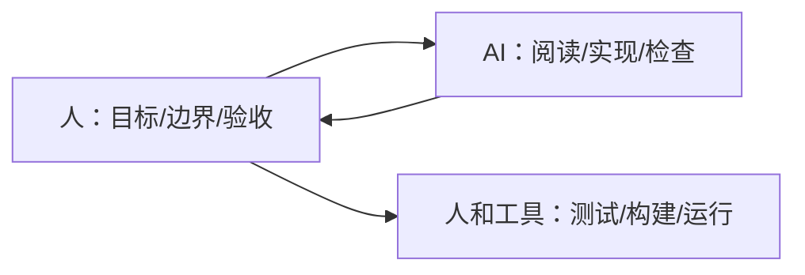

# AI 编程协作模式

AI 编程的关键不是“让 AI 代替开发者”，而是把它当成一个需要明确目标、上下文和验收标准的协作者。

## 适合 AI 的任务

| 任务 | 适合原因 |
| --- | --- |
| 读陌生代码 | 能快速整理结构和调用链 |
| 写测试 | 能覆盖边界和回归场景 |
| 小功能实现 | 需求清晰时效率高 |
| 重构建议 | 能发现重复和职责混乱 |
| 代码审查 | 能做第二遍风险检查 |
| 文档生成 | 能把代码行为转成说明 |

## 不适合直接交给 AI 的任务

1. 未澄清的产品决策。
2. 高风险安全变更。
3. 无测试的生产热修。
4. 大范围架构重写。
5. 需要账号权限和真实业务判断的操作。

这些可以让 AI 辅助分析，但最终决策必须由开发者负责。

## 好任务说明

差：

```text
修一下登录。
```

好：

```text
登录页点击验证码后偶发闪退。请先复现并定位原因，只改 LoginActivity 和 LoginViewModel，补一个 ViewModel 单元测试，最后运行相关测试。
```

好任务说明包含：

1. 症状。
2. 范围。
3. 限制。
4. 验收命令。
5. 是否先分析。

## 协作原则



AI 可以给速度，但验证必须落到命令、测试、截图或真实运行结果上。
