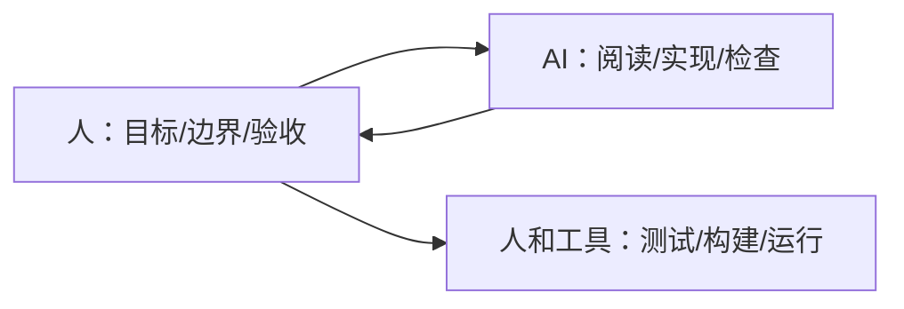

# AI 编程协作模式

AI 编程的关键不是“让 AI 代替开发者”，而是把它当成一个需要明确目标、上下文和验收标准的协作者。

## 适合 AI 的任务

| 任务 | 适合原因 |
| --- | --- |
| 读陌生代码 | 能快速整理结构和调用链 |
| 写测试 | 能覆盖边界和回归场景 |
| 小功能实现 | 需求清晰时效率高 |
| 重构建议 | 能发现重复和职责混乱 |
| 代码审查 | 能做第二遍风险检查 |
| 文档生成 | 能把代码行为转成说明 |

## 不适合直接交给 AI 的任务

1. 未澄清的产品决策。
2. 高风险安全变更。
3. 无测试的生产热修。
4. 大范围架构重写。
5. 需要账号权限和真实业务判断的操作。

这些可以让 AI 辅助分析，但最终决策必须由开发者负责。

## 好任务说明

差：

```text
修一下登录。
```

好：

```text
登录页点击验证码后偶发闪退。请先复现并定位原因，只改 LoginActivity 和 LoginViewModel，补一个 ViewModel 单元测试，最后运行相关测试。
```

好任务说明包含：

1. 症状。
2. 范围。
3. 限制。
4. 验收命令。
5. 是否先分析。

## 任务说明模板

可以直接复制下面模板：

```text
背景：
- 当前现象：
- 期望行为：

范围：
- 允许修改：
- 不要修改：

要求：
- 先阅读相关代码，说明调用链和影响范围。
- 先给出计划，确认后再改。
- 保持最小改动。
- 补充或更新测试。

验收：
- 必须运行：
  - <测试命令 1>
  - <测试命令 2>
- 最终说明：
  - 改了什么
  - 如何验证
  - 剩余风险
```

例如：

```text
背景：
- Android 聊天页点击取消后，偶尔仍会追加模型 delta。
- 期望取消后所有迟到 delta 都被忽略。

范围：
- 允许修改 ChatViewModel、ChatRepository 和对应测试。
- 不要改 UI 样式和后端接口。

要求：
- 先说明事件流如何进入 ViewModel。
- 写一个失败测试复现 cancelled 后收到 delta 的情况。
- 做最小修复。

验收：
- 运行 ./gradlew :app:testDebugUnitTest --tests "*ChatViewModelTest"
- 最终说明验证结果和是否还有边界风险。
```

## 四种任务交付方式

| 方式 | 适合场景 | 人要把关什么 |
| --- | --- | --- |
| 只分析不修改 | 不熟悉代码、风险未知 | 分析是否有证据 |
| 先计划再修改 | 中等复杂功能或 Bug | 计划是否过度扩大范围 |
| 测试先行 | Bug 修复、状态机、解析逻辑 | 测试是否真的复现问题 |
| Review 优先 | 已有 diff、发布前检查 | 是否漏掉高风险路径 |

如果你不确定范围，先让 AI 只分析，不要一上来改代码。

## 常见失败方式

1. 任务太模糊：只说“优化一下”“修一下”。
2. 范围太大：让 AI 同时重构架构、修 Bug、改 UI。
3. 没有验收命令：最后只能靠肉眼判断。
4. 没有测试基线：不知道是修好了还是刚好没触发。
5. 没有保留证据：过几天无法复盘为什么这么改。
6. 把账号、密钥、用户隐私直接贴给外部工具。

AI 编程不是把责任交出去，而是把重复劳动和上下文整理交给工具，把判断和验收留在工程流程里。

## 协作原则



AI 可以给速度，但验证必须落到命令、测试、截图或真实运行结果上。

## 本章小结

好的 AI 编程协作，本质是好的工程任务管理：目标明确、边界清楚、证据充分、验证可复现。任务说明写得越像一张小型工单，AI 产出越容易进入真实项目。
