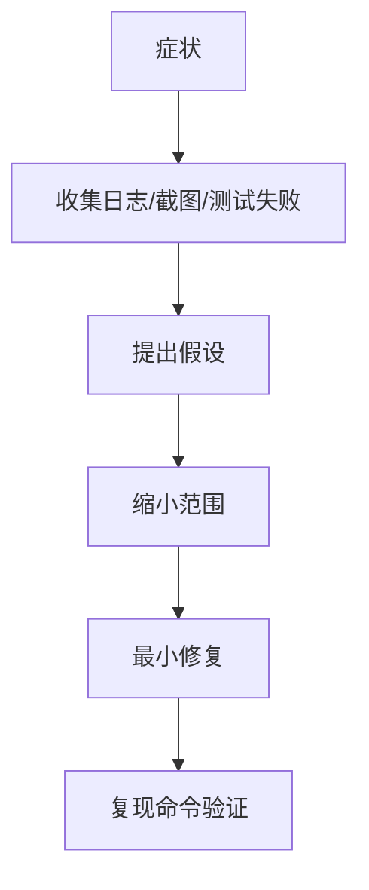

# 测试、Review 与调试工作流

AI 编程最容易出问题的地方，是“代码看起来合理，但没跑过”。所以工作流必须围绕验证设计。

## Bug 修复流程

1. 描述症状和期望。
2. 让 AI 找相关代码和调用链。
3. 写一个能复现问题的失败测试。
4. 修改最小范围代码。
5. 跑测试确认通过。
6. 检查是否影响其他场景。

没有复现用例的 Bug 修复，很容易变成猜测。

## 推荐红绿流程

Bug 修复时，尽量让 AI 按这个节奏工作：

```text
1. 复述症状和期望。
2. 找到最小相关代码。
3. 写一个失败测试，证明当前代码有问题。
4. 运行测试，确认它失败在预期原因上。
5. 做最小修复。
6. 再运行同一测试，确认通过。
7. 运行相关回归测试。
8. 总结修改、验证和剩余风险。
```

如果 AI 直接跳到第 5 步，容易把问题修成“看起来合理”的猜测。

## 调试提示模板

```text
请先不要改代码。
根据下面现象，帮我定位最可能的 3 个原因，并说明每个原因需要什么证据验证。

现象：
- <日志/截图/测试失败>

限制：
- 只分析 <模块/文件范围>
- 不要猜测外部服务状态

输出：
1. 相关调用链
2. 可能原因
3. 需要补充的证据
4. 最小复现测试建议
```

先分析再修，尤其适合偶发崩溃、生命周期、并发、网络和流式输出问题。

## Code Review 提示

可以让 AI 按问题导向审查：

```text
请以代码审查角度检查这次 diff，只列风险和缺失测试。
重点看：
1. 行为回归
2. 空值/边界
3. 权限和安全
4. Android 生命周期
5. 是否需要补测试
```

Review 不要只让 AI “看看有没有问题”。要告诉它关注什么。

## Review 输出格式

建议要求 AI 只输出可行动问题：

```text
请按严重程度输出：
- P0：会导致崩溃、数据泄露、越权、线上不可用
- P1：明显行为回归、关键路径缺测试
- P2：边界问题、可维护性风险

每条问题必须包含：
- 文件和位置
- 为什么是问题
- 可能影响
- 建议验证方式
```

不要让 Review 变成“代码写得不错”这类无证据评价。

## 调试协作



AI 很擅长提出假设，但你要用证据筛掉错误假设。

## 证据记录

每次调试至少记录：

| 证据 | 示例 |
| --- | --- |
| 原始症状 | 用户截图、崩溃堆栈、接口错误、测试失败 |
| 复现方式 | 操作步骤、命令、测试用例 |
| 排除项 | 哪些猜测被验证为不成立 |
| 修复点 | 哪个文件、哪个分支逻辑 |
| 验证结果 | 命令输出、截图、日志 |
| 剩余风险 | 未覆盖设备、未覆盖网络状态、依赖后端数据 |

这些记录可以进入 PR 描述、事故复盘或知识库，后续也能被 RAG 助手检索。

## 测试清单

Android 项目常见清单：

1. ViewModel 状态流测试。
2. Repository 错误映射测试。
3. JSON 解析测试。
4. Compose/Fragment 关键交互测试。
5. 弱网和取消流程测试。

后端项目常见清单：

1. API 合约测试。
2. 权限测试。
3. 幂等和重试测试。
4. 数据库迁移测试。
5. 日志脱敏测试。

AI 可以帮你生成清单，但最终要运行。

## AI 生成测试时要检查什么

1. 测试名是否描述真实行为。
2. 测试是否能在没有外部服务的情况下稳定运行。
3. 是否覆盖成功、失败、取消、重试和边界输入。
4. 是否断言最终状态，而不是只断言“函数被调用”。
5. 是否真的会在旧代码上失败。
6. 是否和业务验收一致。

一个好测试应该像小型需求文档，让未来的人知道这个行为为什么不能坏。

## 本章小结

AI 调试的关键不是让模型一次猜中，而是让它帮助你更快建立假设、写复现、缩小范围和补测试。只要没有验证证据，就不要把修复当成完成。
