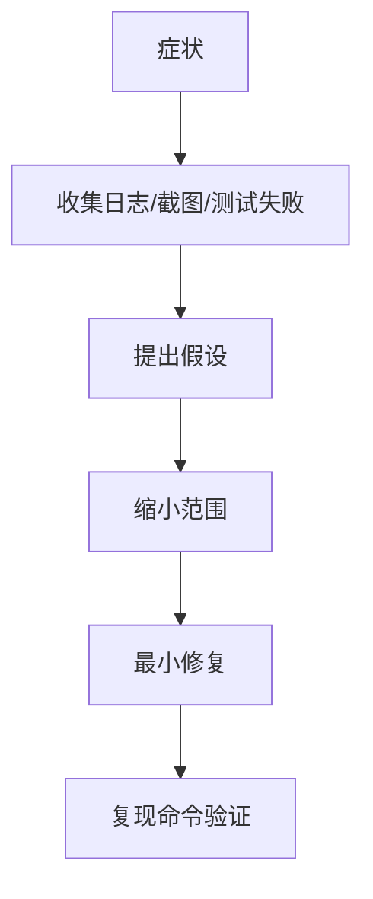

# 测试、Review 与调试工作流

AI 编程最容易出问题的地方，是“代码看起来合理，但没跑过”。所以工作流必须围绕验证设计。

## Bug 修复流程

1. 描述症状和期望。
2. 让 AI 找相关代码和调用链。
3. 写一个能复现问题的失败测试。
4. 修改最小范围代码。
5. 跑测试确认通过。
6. 检查是否影响其他场景。

没有复现用例的 Bug 修复，很容易变成猜测。

## Code Review 提示

可以让 AI 按问题导向审查：

```text
请以代码审查角度检查这次 diff，只列风险和缺失测试。
重点看：
1. 行为回归
2. 空值/边界
3. 权限和安全
4. Android 生命周期
5. 是否需要补测试
```

Review 不要只让 AI “看看有没有问题”。要告诉它关注什么。

## 调试协作



AI 很擅长提出假设，但你要用证据筛掉错误假设。

## 测试清单

Android 项目常见清单：

1. ViewModel 状态流测试。
2. Repository 错误映射测试。
3. JSON 解析测试。
4. Compose/Fragment 关键交互测试。
5. 弱网和取消流程测试。

后端项目常见清单：

1. API 合约测试。
2. 权限测试。
3. 幂等和重试测试。
4. 数据库迁移测试。
5. 日志脱敏测试。

AI 可以帮你生成清单，但最终要运行。
