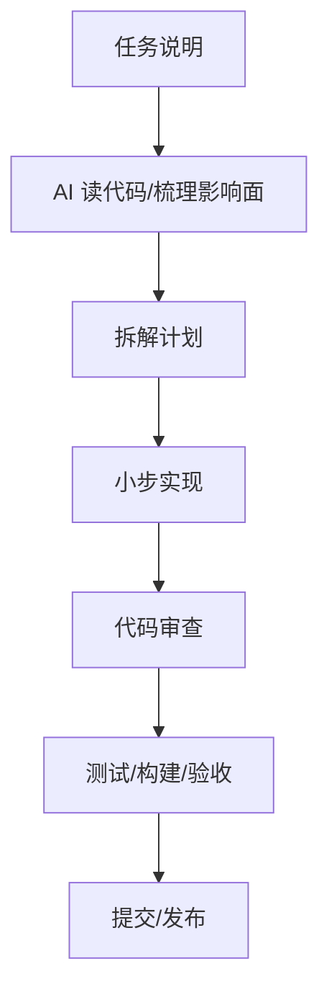

# 阶段十九：AI 编程与研发效率提升

本阶段目标是把大模型和 AI 编程工具变成稳定的研发流程，而不是偶尔“让 AI 写点代码”。你已经会 Android、后端、前端，接下来要学的是如何让 AI 帮你读代码、定位问题、写测试、做代码审查、生成文档和提升交付速度。

## 本阶段你会学到什么

1. 哪些任务适合交给 AI，哪些必须由人把关。
2. 如何写高质量编码任务说明。
3. 如何用 AI 做代码理解、Bug 复现、测试补齐和 Review。
4. 如何建立“AI 产出必须验证”的研发习惯。
5. 如何在团队中沉淀 AGENTS、技能、模板和评审清单。
6. 如何运行一个 AI 编程工作流 Demo。

## 章节目录

1. [AI 编程协作模式](./01-AI编程协作模式.md)
2. [测试、Review 与调试工作流](./02-测试Review与调试工作流.md)
3. [团队规范、知识沉淀与效率度量](./03-团队规范知识沉淀与效率度量.md)
4. [Demo：AI 编程工作流规划](./04-Demo-AI编程工作流规划.md)

## 工作流

## 官方资料

- [Codex best practices](https://developers.openai.com/codex/learn/best-practices)
- [Codex code review in GitHub](https://developers.openai.com/codex/integrations/github)
- [Custom instructions with AGENTS.md](https://developers.openai.com/codex/guides/agents-md)
- [Codex skills](https://developers.openai.com/codex/skills)
