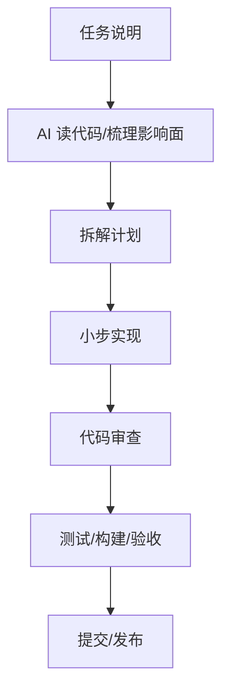

# 阶段十九：AI 编程与研发效率提升

本阶段目标是把大模型和 AI 编程工具变成稳定的研发流程，而不是偶尔“让 AI 写点代码”。你已经会 Android、后端、前端，接下来要学的是如何让 AI 帮你读代码、定位问题、写测试、做代码审查、生成文档和提升交付速度。

## 本阶段你会学到什么

1. 哪些任务适合交给 AI，哪些必须由人把关。
2. 如何写高质量编码任务说明。
3. 如何用 AI 做代码理解、Bug 复现、测试补齐和 Review。
4. 如何建立“AI 产出必须验证”的研发习惯。
5. 如何在团队中沉淀 AGENTS、技能、模板和评审清单。
6. 如何运行一个 AI 编程工作流 Demo。

## 章节目录

1. [AI 编程协作模式](./01-AI编程协作模式.md)
2. [测试、Review 与调试工作流](./02-测试Review与调试工作流.md)
3. [团队规范、知识沉淀与效率度量](./03-团队规范知识沉淀与效率度量.md)
4. [Demo：AI 编程工作流规划](./04-Demo-AI编程工作流规划.md)

## 工作流

## 三种协作模式

| 模式 | 适合场景 | 关键要求 |
| --- | --- | --- |
| 问答模式 | 解释代码、比较方案、学习概念 | 明确问题范围，要求引用文件或证据 |
| 结对模式 | 小功能、Bug 修复、测试补齐 | 给出范围、限制、验收命令 |
| 审查模式 | PR Review、风险检查、发布前检查 | 只列风险、行为回归和缺失测试 |

不要把所有任务都丢给 AI “自由发挥”。越接近生产代码，越需要明确边界和验证。

## 本阶段练习

用“Android 崩溃日志智能分析工具”做一次 AI 编程演练：

1. 写一段任务说明：只允许修改 ViewModel 和 Repository。
2. 要求 AI 先读代码并列影响范围。
3. 写一个失败测试复现“取消后迟到 delta 仍然追加”的问题。
4. 实现最小修复。
5. 让 AI 做 Review，只列风险和缺失测试。
6. 运行测试，把命令和结果记录到总结里。

这个练习的重点不是让 AI 写更多代码，而是练“目标、范围、测试、验证、复盘”的闭环。

## 和贯穿项目的关系

在综合项目里，本阶段回答这些问题：

1. 如何让 AI 帮你读 Android 状态机、后端网关和 RAG 代码。
2. 如何让 AI 为 Prompt、RAG、工具调用补评估用例。
3. 如何用 AGENTS.md 固化“Android 不存模型 Key、后端负责权限”的项目规则。
4. 如何让 AI 做 PR Review，只关注风险和缺失测试。
5. 如何把线上问题复盘沉淀成知识库和测试。

## 学完后的自检问题

- 我能不能写出一段边界清楚的 AI 编程任务说明？
- 我能不能要求 AI 先分析影响范围，再修改代码？
- 我能不能判断一个 AI 生成测试是否真的覆盖了问题？
- 我能不能写出项目级 AGENTS.md 的最小版本？
- 我能不能把 AI 产出和真实验证命令绑定起来？

## 官方资料

- [Codex best practices](https://developers.openai.com/codex/learn/best-practices)
- [Codex code review in GitHub](https://developers.openai.com/codex/integrations/github)
- [Custom instructions with AGENTS.md](https://developers.openai.com/codex/guides/agents-md)
- [Codex skills](https://developers.openai.com/codex/skills)
