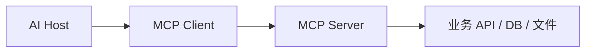

# API、SDK、OpenAPI 与 MCP

AI 应用会接入很多外部能力。关键不是追逐协议名词，而是判断“谁调用谁、调用什么、给谁复用、怎么鉴权、怎么审计”。

## 概念对比

| 形态 | 主要用户 | 适合场景 |
| --- | --- | --- |
| HTTP API | 任意客户端 | 业务系统集成 |
| SDK | 开发者 | 简化语言内调用 |
| OpenAPI | API 文档和工具生成 | 公开或标准化接口 |
| MCP | AI 客户端/Agent | 暴露工具、资源、提示模板 |
| 插件/App | 终端用户和 AI 产品 | 嵌入 UI 或完整体验 |

## 同一个能力的多种暴露方式

以“搜索 Android 知识库”为例：

| 形态 | 示例 | 谁用 |
| --- | --- | --- |
| HTTP API | `POST /api/knowledge/search` | Android、Web、后端服务 |
| SDK | `knowledgeClient.search(query)` | 内部开发者 |
| OpenAPI | 描述 `/api/knowledge/search` 的参数和响应 | 文档、测试、工具生成 |
| MCP Tool | `search_android_knowledge` | AI Host / Agent |
| MCP Resource | `android://runbook/crash` | AI Host 读取上下文 |
| Prompt 模板 | `review_android_crash_log` | 团队复用分析流程 |

它们不应该各自实现一套业务逻辑。更稳的做法是：

```text
核心业务服务
  -> HTTP API
  -> SDK / OpenAPI / MCP / App 适配层
```

适配层负责协议转换，核心服务负责权限、数据、审计和业务规则。

## MCP 解决什么

MCP 让一个 AI 客户端能以标准方式发现和调用外部能力。它不是替代 HTTP API，而是给 AI 客户端使用 API 的统一适配层。



MCP Server 可以暴露：

1. Tools：可执行动作。
2. Resources：可读取上下文。
3. Prompts：可复用提示模板。

一个 MCP Tool 可以包一层内部 API：

```json
{
  "name": "search_android_knowledge",
  "description": "Search Android troubleshooting runbooks visible to the current user.",
  "inputSchema": {
    "type": "object",
    "properties": {
      "query": {"type": "string"},
      "topK": {"type": "integer", "minimum": 1, "maximum": 10}
    },
    "required": ["query"]
  }
}
```

注意：Tool 描述只是给 AI Host 发现能力用的，不等于权限校验。真正执行前仍然要验证用户身份、资源权限、参数和审计。

## 什么时候用 OpenAPI

OpenAPI 适合：

1. 给普通开发者集成。
2. 生成 SDK。
3. 做网关文档。
4. 做接口测试。
5. 给 Agent 工具生成 Schema。

如果你的目标是“让多个 AI 客户端发现和调用工具”，MCP 更贴近。如果你的目标是“让所有系统都能调这个 HTTP 服务”，OpenAPI 更通用。

## OpenAPI 和 MCP 的关系

两者可以共存：

1. 先把业务能力做成 HTTP API。
2. 用 OpenAPI 描述 API，方便普通开发者集成、生成 SDK、做接口测试。
3. 再写 MCP Server，把其中一部分安全能力暴露给 AI Host。

不要直接把所有 OpenAPI 接口一键暴露给模型。模型能看到的工具越多，越需要权限、场景和风险控制。

## Android 视角

Android App 通常不直接接 MCP，而是：

1. 调自己的业务后端 API。
2. 后端内部接 MCP 或 Agent 工具。
3. App 展示结果和状态。

除非你的 App 本身就是 AI Host，否则不要把所有协议复杂度搬到移动端。

## 本章小结

API、SDK、OpenAPI 和 MCP 不是互相替代的关系，而是面向不同调用者的接口层。先把核心业务能力做稳，再决定要给普通客户端、开发者、AI Host 还是终端用户暴露哪一种形态。
