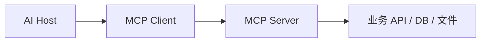

# API、SDK、OpenAPI 与 MCP

AI 应用会接入很多外部能力。关键不是追逐协议名词，而是判断“谁调用谁、调用什么、给谁复用、怎么鉴权、怎么审计”。

## 概念对比

| 形态 | 主要用户 | 适合场景 |
| --- | --- | --- |
| HTTP API | 任意客户端 | 业务系统集成 |
| SDK | 开发者 | 简化语言内调用 |
| OpenAPI | API 文档和工具生成 | 公开或标准化接口 |
| MCP | AI 客户端/Agent | 暴露工具、资源、提示模板 |
| 插件/App | 终端用户和 AI 产品 | 嵌入 UI 或完整体验 |

## MCP 解决什么

MCP 让一个 AI 客户端能以标准方式发现和调用外部能力。它不是替代 HTTP API，而是给 AI 客户端使用 API 的统一适配层。

MCP Server 可以暴露：

1. Tools：可执行动作。
2. Resources：可读取上下文。
3. Prompts：可复用提示模板。

## 什么时候用 OpenAPI

OpenAPI 适合：

1. 给普通开发者集成。
2. 生成 SDK。
3. 做网关文档。
4. 做接口测试。
5. 给 Agent 工具生成 Schema。

如果你的目标是“让多个 AI 客户端发现和调用工具”，MCP 更贴近。如果你的目标是“让所有系统都能调这个 HTTP 服务”，OpenAPI 更通用。

## Android 视角

Android App 通常不直接接 MCP，而是：

1. 调自己的业务后端 API。
2. 后端内部接 MCP 或 Agent 工具。
3. App 展示结果和状态。

除非你的 App 本身就是 AI Host，否则不要把所有协议复杂度搬到移动端。
