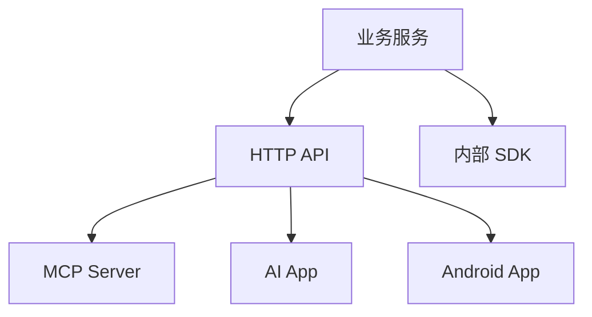

# 生态选型与工程边界

选择协议前，先问三个问题：谁用、用来做什么、失败时谁负责。

## 选型表

| 需求 | 推荐 |
| --- | --- |
| 给 Android/Web 调后端 | HTTP API |
| 给外部开发者集成 | OpenAPI + SDK |
| 给多个 AI 客户端调用工具 | MCP |
| 给终端用户嵌入 UI | AI App / 插件 |
| 团队复用提示流程 | Prompt 模板 / Skill |
| 后端内部编排 | SDK / Agent 框架 |

## 选型问题清单

决定协议前先回答：

1. 调用者是人、普通程序，还是 AI Host？
2. 调用结果是给人看，还是给程序继续处理？
3. 这个能力有没有副作用？
4. 是否需要用户确认？
5. 是否涉及租户、权限或敏感数据？
6. 失败后谁负责重试、降级和解释错误？
7. 版本变化会影响哪些客户端？

这些问题比“现在流行哪个协议”更重要。

## 工程边界

不要把协议层写成业务核心。推荐分层：

核心业务能力应该独立于 MCP、App 或某个 Agent 框架。这样以后协议变化时，不需要重写业务。

## 推荐分层

| 层 | 职责 |
| --- | --- |
| Core Service | 业务规则、权限、数据访问、审计 |
| HTTP API | 给 Android/Web/后端系统调用 |
| OpenAPI | 描述 API、生成文档、生成 SDK、做合约测试 |
| MCP Server | 给 AI Host 暴露安全工具、资源和提示模板 |
| App / 插件 | 给终端用户提供交互 UI |
| Skill / Prompt | 给团队复用工作流 |

协议层可以替换，Core Service 不应该跟着大改。

## 安全边界

任何协议都要处理：

1. 鉴权。
2. 授权。
3. 参数校验。
4. 审计。
5. 限流。
6. 错误处理。
7. 版本兼容。

MCP 工具不是“内部可信函数”。只要模型能调用，就必须当成外部输入处理。

## 版本和兼容

协议适配层也要版本化：

| 对象 | 为什么要版本化 |
| --- | --- |
| OpenAPI | 外部客户端依赖字段和错误码 |
| MCP Tool Schema | AI Host 可能缓存或依赖工具结构 |
| Prompt 模板 | 影响模型行为和评估结果 |
| Resource URI | 影响引用、权限和缓存 |
| App 组件 | 影响用户体验和前端状态 |

修改 Tool 参数、删除字段、改变错误码，都可能让 Agent 或客户端行为变化。要保留兼容期或清晰迁移路径。

## 渐进路线

1. 先把业务能力做成稳定后端 API。
2. 再为内部项目写 SDK 或封装。
3. 如果要给 AI 客户端复用，再加 MCP Server。
4. 如果要给用户完整交互体验，再考虑 App 或插件。

这条路线最稳，因为每一步都有清晰边界。

## 反模式

1. 一开始就直接写 MCP，没有稳定业务 API。
2. 把所有后台接口都暴露给模型。
3. 让模型自己判断用户有没有权限。
4. 把 Prompt、工具 Schema、业务规则混在一起。
5. 没有审计日志，无法追踪模型为什么调用某个工具。
6. 修改工具参数后不跑 Agent 回归评估。

## 本章小结

生态选型的目标不是追协议名词，而是让正确的调用者用正确的方式访问正确的能力。先把业务核心做稳，再按调用者和场景选择 HTTP API、OpenAPI、SDK、MCP、App 或 Skill。
