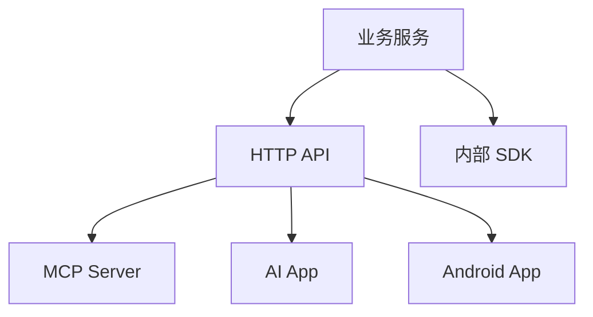

# 生态选型与工程边界

选择协议前，先问三个问题：谁用、用来做什么、失败时谁负责。

## 选型表

| 需求 | 推荐 |
| --- | --- |
| 给 Android/Web 调后端 | HTTP API |
| 给外部开发者集成 | OpenAPI + SDK |
| 给多个 AI 客户端调用工具 | MCP |
| 给终端用户嵌入 UI | AI App / 插件 |
| 团队复用提示流程 | Prompt 模板 / Skill |
| 后端内部编排 | SDK / Agent 框架 |

## 工程边界

不要把协议层写成业务核心。推荐分层：

核心业务能力应该独立于 MCP、App 或某个 Agent 框架。这样以后协议变化时，不需要重写业务。

## 安全边界

任何协议都要处理：

1. 鉴权。
2. 授权。
3. 参数校验。
4. 审计。
5. 限流。
6. 错误处理。
7. 版本兼容。

MCP 工具不是“内部可信函数”。只要模型能调用，就必须当成外部输入处理。

## 渐进路线

1. 先把业务能力做成稳定后端 API。
2. 再为内部项目写 SDK 或封装。
3. 如果要给 AI 客户端复用，再加 MCP Server。
4. 如果要给用户完整交互体验，再考虑 App 或插件。

这条路线最稳，因为每一步都有清晰边界。
