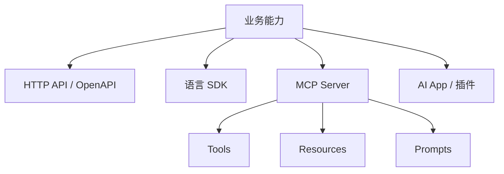

# 阶段二十：生态与协议

本阶段目标是理解大模型应用生态中的 API、SDK、MCP、插件、工具、资源、提示模板和应用扩展方式。学完后，你应该能判断一个能力应该做成普通 HTTP API、SDK 封装、MCP Server、AI App、内部 Agent 工具，还是 Android/前端内置功能。

## 本阶段你会学到什么

1. API、SDK、OpenAPI、MCP、插件和应用扩展的边界。
2. MCP 的 Tools、Resources、Prompts 分别适合什么。
3. 如何为后端能力设计 AI 可调用工具。
4. 如何避免把协议当成业务架构本身。
5. Android、后端、前端如何接入这些生态能力。
6. 如何运行一个协议选择 Demo。

## 章节目录

1. [API、SDK、OpenAPI 与 MCP](./01-API-SDK-OpenAPI与MCP.md)
2. [Tools、Resources、Prompts 与应用扩展](./02-ToolsResourcesPrompts与应用扩展.md)
3. [生态选型与工程边界](./03-生态选型与工程边界.md)
4. [Demo：AI 协议选择器](./04-Demo-AI协议选择器.md)

## 关系图



## 选型口诀

可以先用一句话判断：

```text
普通系统调用，用 HTTP API；
开发者复用，用 SDK；
接口标准化，用 OpenAPI；
AI Host 调工具和读上下文，用 MCP；
终端用户需要 UI，用 App / 插件；
团队复用工作流，用 Prompt 模板或 Skill。
```

协议是连接方式，不是业务核心。核心业务能力应该先有稳定后端 API 和权限模型，再按需要暴露给不同生态。

## 本阶段练习

以“Android 知识库助手”为例，分别设计：

1. 给 Android App 调用的 `/api/chat`。
2. 给其他后端系统集成的 OpenAPI 描述。
3. 给 AI 客户端使用的 MCP Tool：`search_android_knowledge`。
4. 给 AI 客户端读取的 MCP Resource：`android://runbook/crash`.
5. 给团队复用的 Prompt：`review_android_crash_log`.

练习目标不是写完整服务，而是判断每种形态的用户、输入、输出、权限和失败处理。

## 和贯穿项目的关系

在综合项目里，本阶段回答这些问题：

1. Android App 应该调用普通 HTTP API，还是直接接 MCP。
2. 后端知识库搜索能力是否要提供 OpenAPI。
3. 哪些能力适合作为 MCP Tool 暴露给 AI 客户端。
4. 哪些资料适合作为 MCP Resource 读取。
5. 团队里的崩溃分析流程是否应该沉淀成 Prompt 模板或 Skill。

## 学完后的自检问题

- 我能不能区分 API、SDK、OpenAPI、MCP、App/插件和 Skill？
- 我能不能说明 MCP 为什么不是 HTTP API 的替代品？
- 我能不能为同一个业务能力设计 HTTP API 和 MCP Tool 两种入口？
- 我能不能判断一个能力应该做成 Tool、Resource 还是 Prompt？
- 我能不能说出协议适配层为什么不应该承载业务核心？

## 官方资料

- [Model Context Protocol specification](https://modelcontextprotocol.io/specification/2025-06-18)
- [MCP Tools](https://modelcontextprotocol.io/specification/2025-06-18/server/tools)
- [OpenAI Apps SDK](https://developers.openai.com/apps-sdk)
- [OpenAI SDKs and CLI](https://developers.openai.com/api/docs/libraries)
- [Codex skills](https://developers.openai.com/codex/skills)
