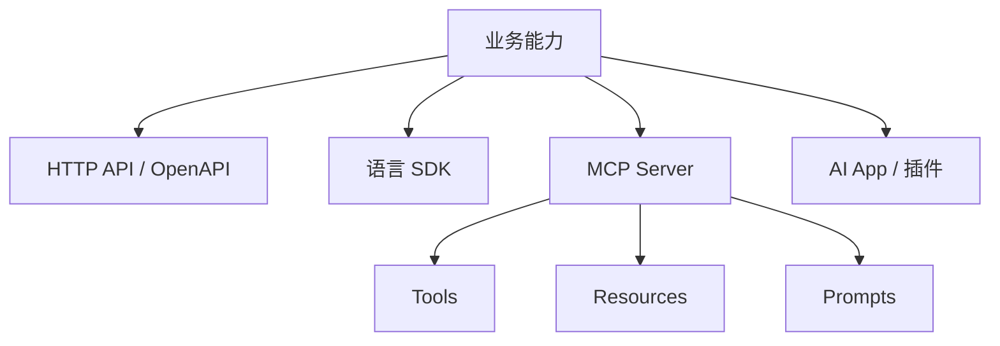

# 阶段二十：生态与协议

本阶段目标是理解大模型应用生态中的 API、SDK、MCP、插件、工具、资源、提示模板和应用扩展方式。学完后，你应该能判断一个能力应该做成普通 HTTP API、SDK 封装、MCP Server、AI App、内部 Agent 工具，还是 Android/前端内置功能。

## 本阶段你会学到什么

1. API、SDK、OpenAPI、MCP、插件和应用扩展的边界。
2. MCP 的 Tools、Resources、Prompts 分别适合什么。
3. 如何为后端能力设计 AI 可调用工具。
4. 如何避免把协议当成业务架构本身。
5. Android、后端、前端如何接入这些生态能力。
6. 如何运行一个协议选择 Demo。

## 章节目录

1. [API、SDK、OpenAPI 与 MCP](./01-API-SDK-OpenAPI与MCP.md)
2. [Tools、Resources、Prompts 与应用扩展](./02-ToolsResourcesPrompts与应用扩展.md)
3. [生态选型与工程边界](./03-生态选型与工程边界.md)
4. [Demo：AI 协议选择器](./04-Demo-AI协议选择器.md)

## 关系图

## 官方资料

- [Model Context Protocol specification](https://modelcontextprotocol.io/specification/2025-06-18)
- [MCP Tools](https://modelcontextprotocol.io/specification/2025-06-18/server/tools)
- [OpenAI Apps SDK](https://developers.openai.com/apps-sdk)
- [OpenAI SDKs and CLI](https://developers.openai.com/api/docs/libraries)
- [Codex skills](https://developers.openai.com/codex/skills)
