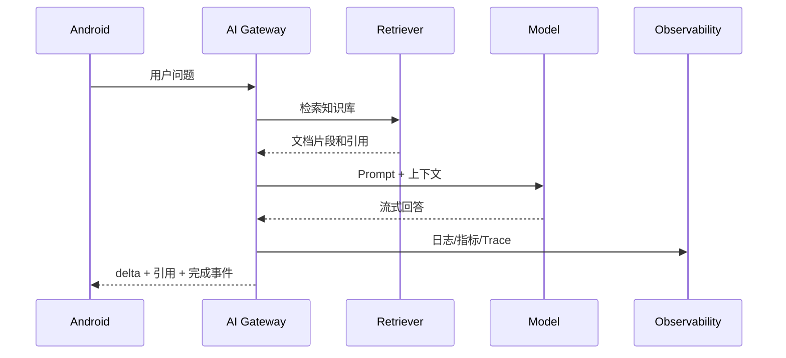

# 项目范围与总体架构

综合项目不要一开始就做成“万能 AI 平台”。第一版建议聚焦一个场景：Android 知识库助手。

## MVP 范围

第一版只做：

1. 用户登录后发起文本问题。
2. 后端从知识库检索相关片段。
3. 模型基于片段回答。
4. 返回引用来源。
5. Android 展示流式回答、引用和错误状态。
6. 后端记录请求日志、token、成本和延迟。

暂不做：

1. 多 Agent 自主规划。
2. 自动写数据库。
3. 复杂权限矩阵。
4. 私有化部署。
5. 大规模微调。

## 模块划分

| 模块 | 职责 |
| --- | --- |
| Android App | 输入、状态、流式展示、引用、语音/图片入口 |
| AI Gateway | 鉴权、路由、Prompt、模型调用、日志 |
| Knowledge Ingestion | 文档上传、清洗、切分、索引 |
| Retriever | 向量检索、关键词检索、重排 |
| Agent Tools | 查询状态、创建工单、人工确认 |
| Eval Harness | 评估集、打分、回归门禁 |
| LLMOps | 监控、告警、灰度、回滚 |
| Security | 脱敏、权限、输出校验、红队 |

## 数据流

## 技术边界

Android 永远不保存模型 Key。所有模型调用、知识库权限、工具执行都在后端完成。Android 只负责用户体验和本地状态。
