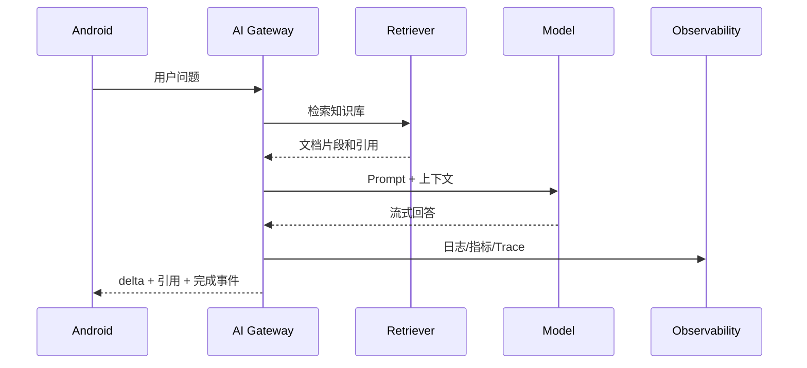

# 项目范围与总体架构

综合项目不要一开始就做成“万能 AI 平台”。第一版建议聚焦一个场景：Android 知识库助手。

推荐把场景说得更具体一点：

```text
面向 Android 团队的内部知识库助手，帮助开发者根据崩溃、ANR、接口错误和项目规范快速找到排查路径。
```

这个场景足够小，但能覆盖前面大多数阶段：Prompt、结构化输出、RAG、工具调用、Android 流式体验、评估、LLMOps 和安全。

## MVP 范围

第一版只做：

1. 用户登录后发起文本问题。
2. 后端从知识库检索相关片段。
3. 模型基于片段回答。
4. 返回引用来源。
5. Android 展示流式回答、引用和错误状态。
6. 后端记录请求日志、token、成本和延迟。

暂不做：

1. 多 Agent 自主规划。
2. 自动写数据库。
3. 复杂权限矩阵。
4. 私有化部署。
5. 大规模微调。

MVP 的判断标准是：一个真实用户可以问一个内部知识库问题，系统能给出带引用的回答；如果资料不足，系统会明确拒答；后端能追踪这次请求发生了什么。

## 模块划分

| 模块 | 职责 |
| --- | --- |
| Android App | 输入、状态、流式展示、引用、语音/图片入口 |
| AI Gateway | 鉴权、路由、Prompt、模型调用、日志 |
| Knowledge Ingestion | 文档上传、清洗、切分、索引 |
| Retriever | 向量检索、关键词检索、重排 |
| Agent Tools | 查询状态、创建工单、人工确认 |
| Eval Harness | 评估集、打分、回归门禁 |
| LLMOps | 监控、告警、灰度、回滚 |
| Security | 脱敏、权限、输出校验、红队 |

## 推荐目录形态

真实项目可以按下面方式拆目录。这里不是要求你马上创建这些文件，而是先明确边界：

```text
android-app/
  chat/
    ChatViewModel
    ChatUiState
    ChatRepository
backend/
  api/
    chat_controller
  ai_gateway/
    prompt_renderer
    model_router
    stream_adapter
    request_logger
  knowledge/
    ingestion_pipeline
    retriever
    citation_builder
  tools/
    ticket_tool
    status_query_tool
  evals/
    eval_cases
    eval_runner
  security/
    input_guard
    output_validator
    permission_filter
docs/
  runbook/
  api_contracts/
  incident_reviews/
```

关键是不要让 Android、RAG、模型调用、工具执行和评估全部混在一个文件里。每个模块都应该有清楚职责。

## 数据流



## 请求数据模型

第一版可以先用一个很小的请求体：

```json
{
  "conversationId": "conv_001",
  "message": "空指针崩溃怎么排查？",
  "attachments": [],
  "client": {
    "platform": "android",
    "appVersion": "1.0.0",
    "networkType": "wifi"
  }
}
```

后端补充这些字段：

```json
{
  "requestId": "req_001",
  "userId": "user_123",
  "tenantId": "android_team",
  "promptVersion": "crash_assistant_v1",
  "retrieverVersion": "kb_android_v1",
  "modelRoute": "quality_default"
}
```

这样日志、评估、排查和回归都能追踪到版本。

## 流式事件协议

不要把模型供应商的原始流式事件直接暴露给 Android。建议后端转换成稳定业务事件：

| 事件 | 说明 |
| --- | --- |
| `message.started` | 后端已创建请求，返回 requestId |
| `message.delta` | 一段新增文本 |
| `citation.added` | 新增引用来源 |
| `message.completed` | 回答结束，附带 usage |
| `message.failed` | 失败，附带可展示错误码 |
| `message.cancelled` | 用户取消或后端停止 |

示例：

```json
{"type":"message.started","requestId":"req_001"}
{"type":"message.delta","text":"先看 FATAL EXCEPTION 所在线程..."}
{"type":"citation.added","sourceId":"android_crash_guide","title":"Android 崩溃排查知识"}
{"type":"message.completed","usage":{"inputTokens":900,"outputTokens":180,"estimatedCost":0.002}}
```

Android 端只关心这些业务事件，并把它们映射成 UI 状态。

## 知识库数据模型

文档进入知识库前，至少保留这些元数据：

| 字段 | 作用 |
| --- | --- |
| `docId` | 稳定文档 ID |
| `title` | 展示给用户的标题 |
| `sourceUri` | 引用跳转地址 |
| `version` | 文档版本 |
| `visibility` | 权限范围 |
| `owner` | 维护人 |
| `updatedAt` | 更新时间 |
| `tags` | 检索过滤和分类 |

切分后的 chunk 还要记录：

```json
{
  "chunkId": "android_crash_guide#003",
  "docId": "android_crash_guide",
  "title": "NullPointerException 排查",
  "text": "排查时先看 FATAL EXCEPTION...",
  "visibility": ["android_team"],
  "version": "2026-07-10"
}
```

RAG 检索必须先按 `visibility` 过滤，再做语义检索和重排。不要把不可见内容交给模型后再让模型自己判断。

## Prompt 边界

第一版 Prompt 可以固定成三段：

```text
角色：你是 Android 团队内部知识库助手。
任务：只基于给定资料回答用户问题，并给出可执行排查步骤。
边界：如果资料不足，明确说不知道，并列出需要补充的信息。
```

输入上下文建议包括：

1. 用户问题。
2. 检索到的文档片段。
3. 用户可见权限范围。
4. 当前客户端状态。
5. 输出格式要求。

Prompt 版本必须入日志。后续优化 Prompt 时，评估结果才能对比。

## 技术边界

Android 永远不保存模型 Key。所有模型调用、知识库权限、工具执行都在后端完成。Android 只负责用户体验和本地状态。

更具体地说：

1. Android 负责输入、展示、取消、重试、权限提示和本地状态。
2. AI Gateway 负责鉴权、Prompt、模型路由、流式适配、日志和错误码。
3. Knowledge 模块负责文档清洗、切分、索引、检索、重排和引用。
4. Tool 模块负责受控业务动作，不允许模型直接绕过权限调用内部接口。
5. Eval/LLMOps/Security 模块负责上线前后治理，不应该等功能写完再补。

## 第一版不要做的事

这些能力很诱人，但不适合作为第一周目标：

1. 自动修改线上数据。
2. 让 Agent 自主规划长任务。
3. 做复杂多租户后台。
4. 一开始就接多个模型供应商。
5. 一开始就做微调。
6. 在 Android 端直接接 MCP 或模型供应商。

先把文本问答、RAG 引用、流式状态、日志和评估闭环做好，再扩展智能程度。
