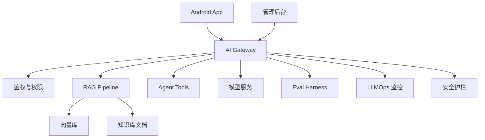

# 阶段二十一：综合实战项目

本阶段目标是把前面 20 个阶段串起来，完成一个适合 Android 开发者落地的大模型项目：Android 知识库助手。它包含 Android 客户端、后端 AI 网关、RAG、语音/图片、多步骤工具、评估、LLMOps 和安全治理。

## 项目目标

做一个面向内部团队或垂直业务的知识库助手：

1. Android 端支持文本问答、语音输入、图片/截图提问。
2. 后端网关负责鉴权、限流、模型路由和日志。
3. 知识库支持文档导入、切分、向量检索和引用。
4. Agent 可以调用受控工具，例如创建工单或查询状态。
5. 系统有评估集、监控、告警、灰度和安全红队用例。

## 章节目录

1. [项目范围与总体架构](./01-项目范围与总体架构.md)
2. [里程碑拆解与实现顺序](./02-里程碑拆解与实现顺序.md)
3. [验收标准、上线清单与扩展方向](./03-验收标准上线清单与扩展方向.md)
4. [Demo：综合项目蓝图生成器](./04-Demo-综合项目蓝图生成器.md)

## 总体架构

## 最终能力清单

| 能力 | 对应阶段 |
| --- | --- |
| API 调用和流式输出 | 2、10、12 |
| Prompt 和结构化输出 | 3、4 |
| RAG 知识库 | 6、7、8 |
| Agent 工具调用 | 9 |
| 前端/Android 体验 | 11、12 |
| 语音与图片 | 13 |
| 评估与测试 | 14 |
| 运维与监控 | 15 |
| 安全 | 18 |
| AI 编程提效 | 19 |
| 生态协议 | 20 |
