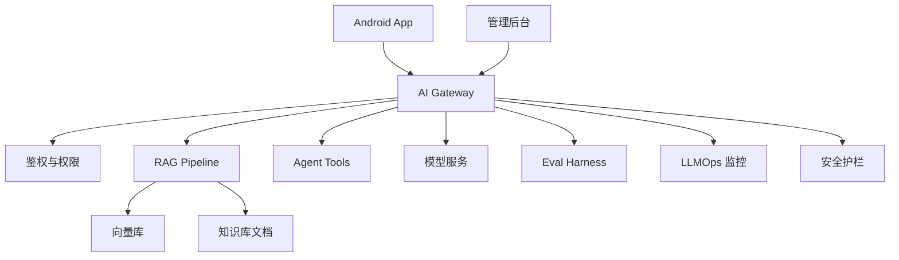

# 阶段二十一：综合实战项目

本阶段目标是把前面 20 个阶段串起来，完成一个适合 Android 开发者落地的大模型项目：Android 知识库助手。它包含 Android 客户端、后端 AI 网关、RAG、语音/图片、多步骤工具、评估、LLMOps 和安全治理。

这不是要你一次做出一个完整平台。综合项目的正确打开方式是：先做一个能问答、能引用、能记录日志的 MVP，再逐步增加知识库、多模态、Agent 工具、评估、运维和安全门禁。

## 项目目标

做一个面向内部团队或垂直业务的知识库助手：

1. Android 端支持文本问答、语音输入、图片/截图提问。
2. 后端网关负责鉴权、限流、模型路由和日志。
3. 知识库支持文档导入、切分、向量检索和引用。
4. Agent 可以调用受控工具，例如创建工单或查询状态。
5. 系统有评估集、监控、告警、灰度和安全红队用例。

## 推荐业务场景

如果你没有现成业务，可以用下面场景练习：

```text
Android 团队内部知识库助手
```

它回答的问题包括：

1. “空指针崩溃怎么排查？”
2. “接口 401 和 403 分别应该怎么处理？”
3. “这个 ANR 日志下一步该看什么？”
4. “这个截图里的错误提示应该走哪个排查流程？”
5. “根据这段日志创建一条排查工单。”

这个场景适合贯穿整套教程，因为它同时需要 Prompt、结构化输出、RAG、工具调用、Android UI、评估、运维和安全。

## 章节目录

1. [项目范围与总体架构](./01-项目范围与总体架构.md)
2. [里程碑拆解与实现顺序](./02-里程碑拆解与实现顺序.md)
3. [验收标准、上线清单与扩展方向](./03-验收标准上线清单与扩展方向.md)
4. [Demo：综合项目蓝图生成器](./04-Demo-综合项目蓝图生成器.md)

## 总体架构



## MVP 能力边界

第一版只要求形成完整闭环：

1. Android 端能发起文本问题。
2. 后端能鉴权、生成 requestId、检索知识库、调用模型。
3. 返回结果包含流式文本、引用、错误状态和完成事件。
4. 日志能追踪 promptVersion、retrieverVersion、model、token、latency、cost。
5. 知识库无答案时，系统能拒答并提示用户补充信息。

第一版不做：

1. 自主多 Agent 规划。
2. 自动修改数据库。
3. 复杂管理后台。
4. 大规模私有化部署。
5. 微调训练。

## 最小接口草图

```http
POST /api/chat
Authorization: Bearer <app-session-token>
Content-Type: application/json

{
  "conversationId": "conv_001",
  "message": "空指针崩溃怎么排查？",
  "client": {
    "platform": "android",
    "appVersion": "1.0.0"
  }
}
```

流式事件建议由后端统一转换成客户端可理解的协议：

```json
{"type":"message.started","requestId":"req_001"}
{"type":"message.delta","text":"先看 FATAL EXCEPTION..."}
{"type":"citation.added","sourceId":"doc_android_crash","title":"Android 崩溃排查知识"}
{"type":"message.completed","usage":{"inputTokens":1200,"outputTokens":220}}
```

这样 Android 不需要直接理解模型供应商的原始事件格式。

## 最终能力清单

| 能力 | 对应阶段 |
| --- | --- |
| API 调用和流式输出 | 2、10、12 |
| Prompt 和结构化输出 | 3、4 |
| RAG 知识库 | 6、7、8 |
| Agent 工具调用 | 9 |
| 前端/Android 体验 | 11、12 |
| 语音与图片 | 13 |
| 评估与测试 | 14 |
| 运维与监控 | 15 |
| 安全 | 18 |
| AI 编程提效 | 19 |
| 生态协议 | 20 |

## 怎么学习本阶段

建议按下面顺序走：

1. 先读项目范围，确认 MVP 不做什么。
2. 再读里程碑，把项目拆成 4 个可交付版本。
3. 再读验收清单，把功能、质量、安全、运维门禁写成检查项。
4. 最后运行 Demo，生成一份项目蓝图，把它当成真实项目的初始任务清单。

学完后，你应该能回答一个问题：如果明天要在团队里启动一个 Android 知识库助手，第一周应该先做哪些文件、接口、状态和验证。
